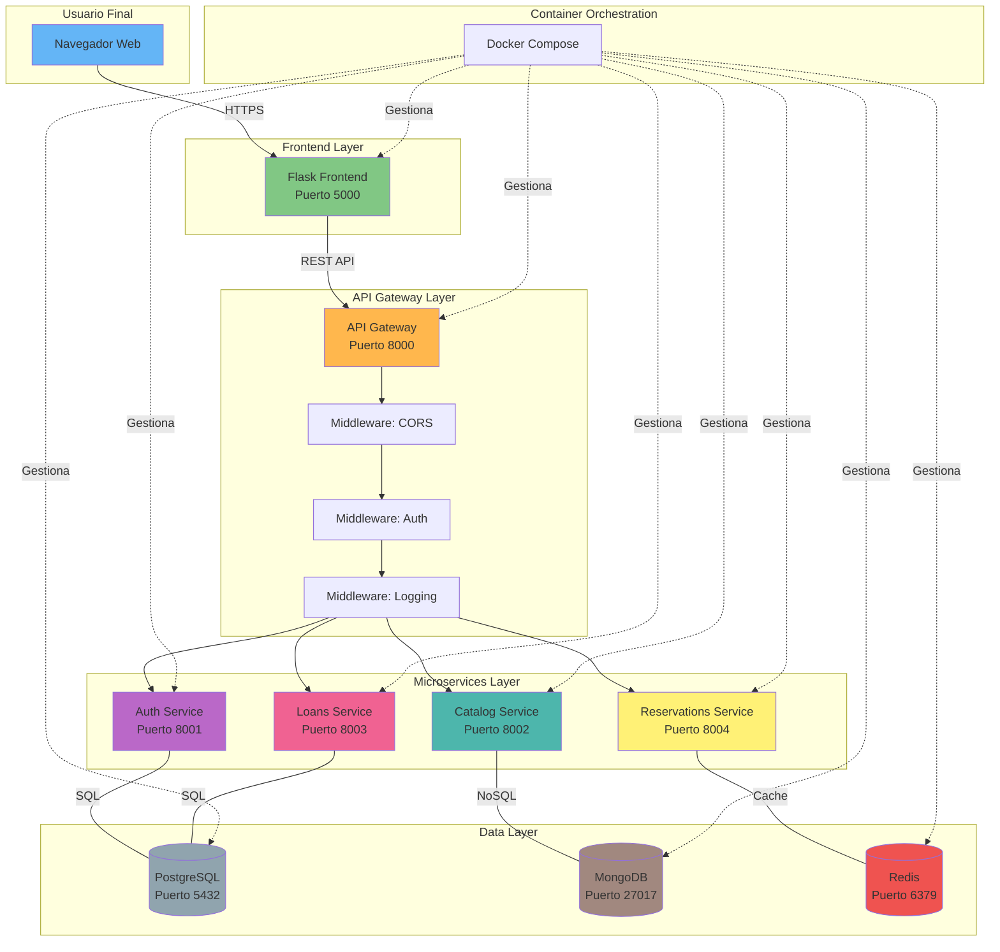
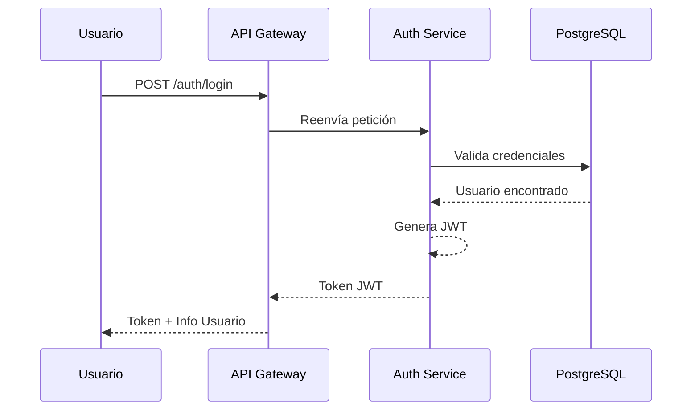
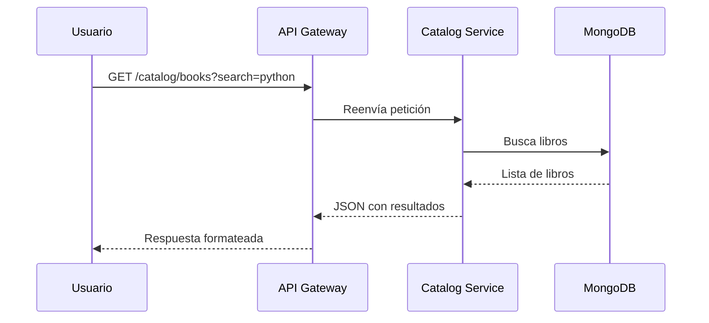
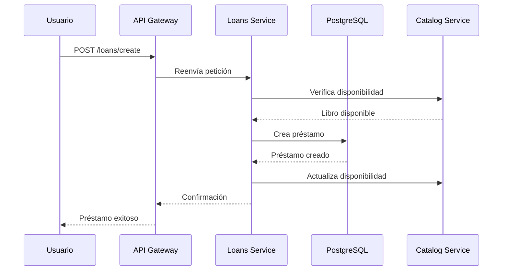
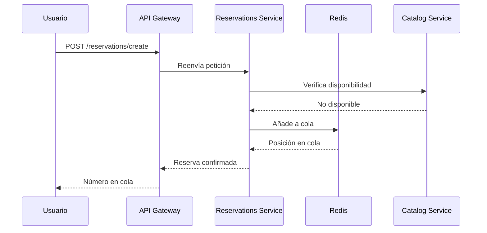
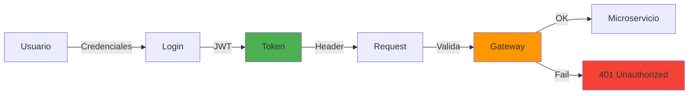
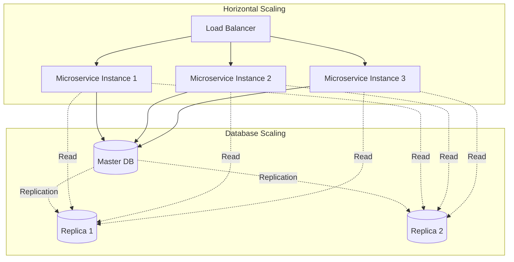

# Visión General de la Arquitectura

## Introducción

El Sistema de PIGBU Biblioteca Universitaria implementa una **arquitectura de microservicios** que divide la aplicación en servicios independientes, cada uno con una responsabilidad específica y bien definida.

## Principios Arquitectónicos

### 1. Separación de Responsabilidades

Cada microservicio tiene una única responsabilidad bien definida:

- **Autenticación**: Gestión de usuarios y seguridad
- **Catálogo**: Información de libros y recursos
- **Préstamos**: Transacciones de préstamo y devolución
- **Reservas**: Sistema de reservas y cola de espera

### 2. Autonomía de Servicios

Los servicios son independientes y pueden:

- Desplegarse de forma independiente
- Escalar según necesidad
- Usar diferentes tecnologías
- Tener su propia base de datos

### 3. Comunicación por API

La comunicación entre componentes se realiza mediante:

- **HTTP/REST**: Para comunicación síncrona
- **JSON**: Como formato de intercambio de datos
- **JWT**: Para autenticación y autorización

## Diagrama de Arquitectura Completo



## Capas del Sistema

### 1. Capa de Presentación

**Frontend con Flask**

Proporciona la interfaz de usuario web:

```
Frontend
├── Templates (HTML/Jinja2)
├── Static Assets (CSS/JS)
└── Lógica de Presentación
```

**Características**:

- Diseño responsivo con CSS moderno
- JavaScript vanilla para interactividad
- Integración con API Gateway
- Manejo de sesiones y tokens

### 2. Capa de Gateway

**API Gateway**

Punto de entrada único para todas las peticiones:

```python
# Ejemplo de configuración del Gateway
from fastapi import FastAPI
from fastapi.middleware.cors import CORSMiddleware

app = FastAPI()

# Middleware de CORS
app.add_middleware(
    CORSMiddleware,
    allow_origins=["*"],
    allow_credentials=True,
    allow_methods=["*"],
    allow_headers=["*"],
)
```

**Responsabilidades**:

- Enrutamiento de peticiones
- Autenticación centralizada
- Rate limiting
- Logging y monitoreo
- Manejo de errores global

### 3. Capa de Microservicios

Cada microservicio implementa lógica de negocio específica:

#### Servicio de Autenticación



#### Servicio de Catálogo



#### Servicio de Préstamos



#### Servicio de Reservas



### 4. Capa de Datos

El sistema utiliza múltiples tecnologías de almacenamiento:

=== "PostgreSQL"
    **Uso**: Datos transaccionales y relacionales
    
    - Usuarios y autenticación
    - Préstamos y devoluciones
    - Historial de transacciones
    
    **Ventajas**:
    - Relaciones complejas
    - Integridad referencial

=== "MongoDB"
    **Uso**: Documentos y datos no estructurados
    
    - Catálogo de libros
    - Metadatos bibliográficos
    - Búsquedas flexibles
    
    **Ventajas**:
    - Esquema flexible
    - Búsquedas de texto completo
    - Escalabilidad horizontal

=== "Redis"
    **Uso**: Caché y datos temporales
    
    - Cola de reservas
    - Sesiones activas
    - Caché de consultas
    
    **Ventajas**:
    - Acceso ultra rápido
    - Estructuras de datos avanzadas
    - Expiración automática


## Consideraciones de Seguridad

### Autenticación y Autorización



### Principios Aplicados

1. **Autenticación en Gateway**: Validación centralizada de tokens
2. **JWT con Expiración**: Tokens de corta duración
3. **HTTPS**: Encriptación de datos en tránsito

## Escalabilidad

### Estrategias de Escalado




!!! info "Documentación de Microservicios"
    Para detalles específicos de cada microservicio, consulta la sección [Microservicios](../microservices/authentication.md).