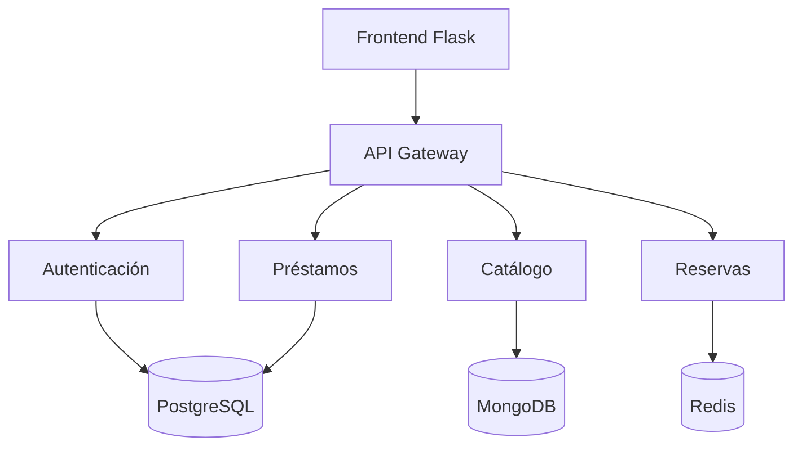

# Sistema de Biblioteca Universitaria

¡Bienvenido a la documentación del Sistema de PIGBU Biblioteca Universitaria!

## Arquitectura del Sistema


## Características

- ✅ Autenticación con JWT
- ✅ Catálogo de libros
- ✅ Sistema de préstamos
- ✅ Reservas con cola

## Inicio 
Crea las imagenes de contenedores

```bash
docker-compose build --no-cache
```
Levanta el servicio 

```bash
docker-compose up
```

Accede a: http://localhost:5000
