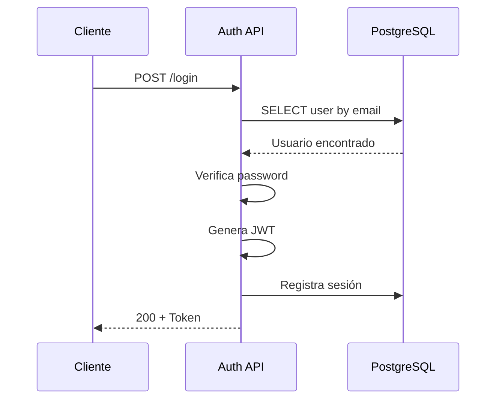

# Microservicio de Autenticación

## Descripción

El microservicio de autenticación es responsable de gestionar todos los aspectos relacionados con usuarios, sesiones y seguridad del sistema.

## Responsabilidades

    ✅Registro de nuevos usuarios
    ✅Autenticación con credenciales
    ✅Generación y validación de token JWT
    ✅Gestión de roles y permisos 
    ✅ Recuperación de contraseñas
    ✅Gestión de sesiones  

## Arquitectura del servicio 

  ```mermaid
  graph TB
    subgraph "API Endpoints"
        EP1[POST /register]
        EP2[POST /login]
        EP3[GET /me]
        EP4[POST /refresh]
    end
    
    subgraph "Business Logic"
        BL[Auth Service]
        JWT[JWT Manager]
        HASH[Password Hasher]
    end
    
    subgraph "Data Access"
        MODELS[SQLAlchemy Models]
        DB[(PostgreSQL)]
    end
    
    EP1 & EP2 & EP3 & EP4 --> BL
    BL --> JWT
    BL --> HASH
    BL --> MODELS
    MODELS --> DB
    
    style EP1 fill:#e3f2fd
    style EP2 fill:#e3f2fd
    style EP3 fill:#e3f2fd
    style EP4 fill:#e3f2fd
    style BL fill:#f3e5f5
    style DB fill:#c8e6c9
  ```

## Endpoints

### POST /auth/login

Autentica un usuario y retorna un token JWT.

**Request**:
```json
{
  "email": "usuario@ejemplo.com",
  "password": "contraseña_segura"
}
```

**Response**:
```json
{
  "access_token": "eyJhbGciOiJIUzI1NiIsInR5cCI6IkpXVCJ9...",
  "token_type": "bearer",
  "user": {
    "id": 1,
    "email": "usuario@ejemplo.com",
    "username": "usuario123",
    "role": "user"
  }
}
```
## Flujo del Login 




