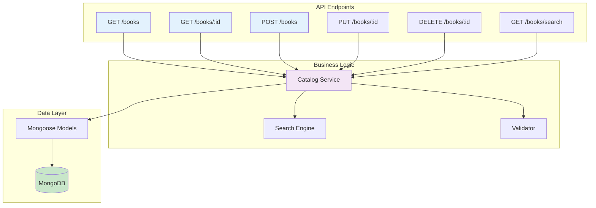
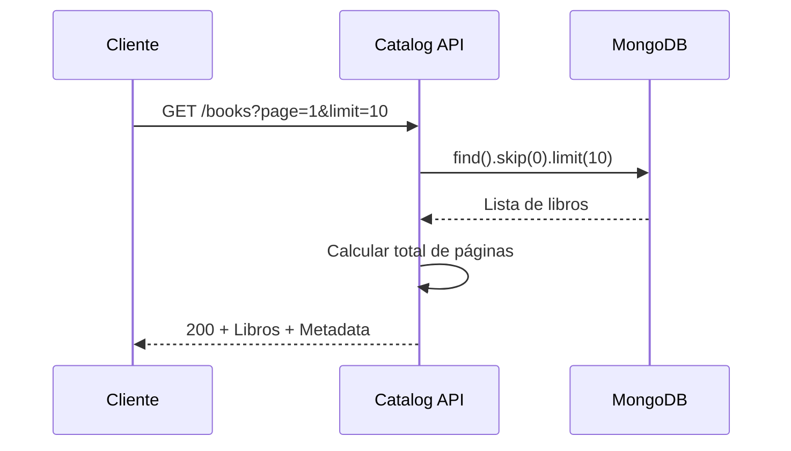

# Microservicio de Catálogo

## Descripción General

El microservicio de catálogo es responsable de gestionar toda la información bibliográfica del sistema, incluyendo libros, autores, categorías y disponibilidad.

## Responsabilidades

    ✅Gestión de libros 
    ✅Búsqueda y filtrado avanzado
    ✅Gestión de categorías
    ✅Control de disponibilidad
    ✅Información bibliográfica completa
    ✅Estadísticas del catálogo

## Arquitectura del Servicio



## Endpoints 

### Listar Todos los Libros

**Endpoint**: `GET /catalog/books`

Lista todos los libros con paginación.

**Query Parameters**:
```
page: int = 1          # Número de página
limit: int = 10        # Libros por página
category: str = None   # Filtrar por categoría
```

**Response** 
```json
{
  "total": 150,
  "page": 1,
  "limit": 10,
  "books": [
    {
      "_id": "507f1f77bcf86cd799439011",
      "isbn": "978-3-16-148410-0",
      "title": "Clean Code",
      "author": "Robert C. Martin",
      "publisher": "Prentice Hall",
      "year": 2008,
      "category": "Programación",
      "description": "Guía de buenas prácticas",
      "total_copies": 5,
      "available_copies": 3,
      "is_available": true,
      "created_at": "2024-01-15T10:30:00Z"
    }
  ]
}
```

## Flujo de Listado:




