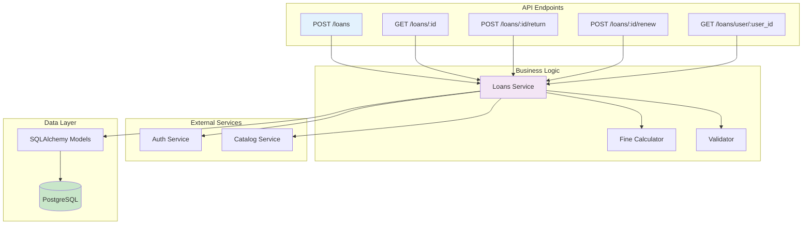
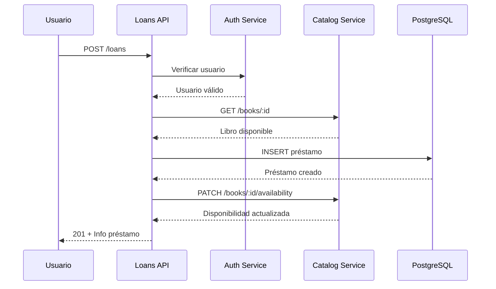

# Microservicio de Préstamos

## Descripción General

El microservicio de préstamos gestiona todo el ciclo de vida de los préstamos de libros, desde la solicitud hasta la devolución, incluyendo el cálculo de multas por retraso.

## Responsabilidades

    ✅ Crear préstamos de libros
    ✅ Devolver libros
    ✅ Renovar préstamos
    ✅ Calcular multas por retraso
    ✅ Historial de préstamos
    ✅ Reportes de préstamos activos

## Arquitectura del Servicio



## Endpoints 

## Crear Préstamo

**Endpoint**: `POST /loans`

Crea un nuevo préstamo de libro.

**Request**
```json
{
  "user_id": 123,
  "book_id": "507f1f77bcf86cd799439011"
}
```

**Response**
```json
{
  "id": 1,
  "user_id": 123,
  "book_id": "507f1f77bcf86cd799439011",
  "loan_date": "2024-01-15",
  "due_date": "2024-01-30",
  "status": "active",
  "fine_amount": 0.00,
  "is_returned": false,
  "message": "Préstamo creado exitosamente"
}
```

## Flujo de Creación



