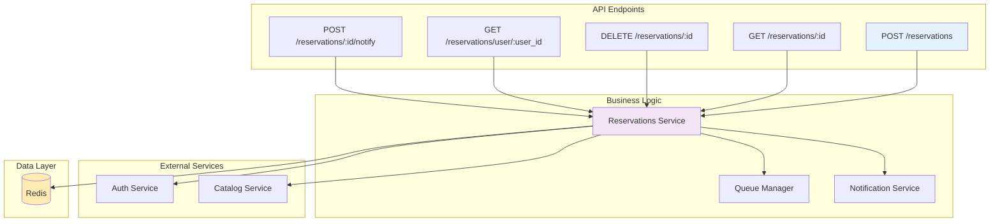
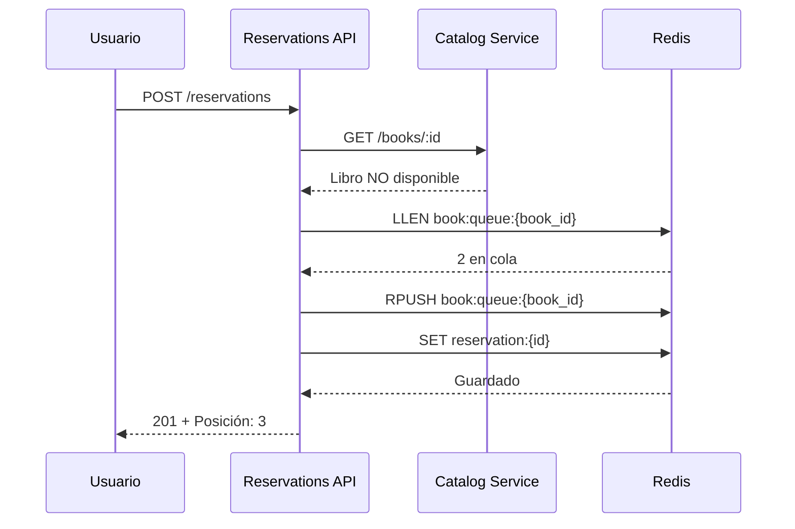

# Microservicio de Reservas

## Descripción General

El microservicio de reservas gestiona la cola de espera para libros que no están disponibles, notificando a los usuarios cuando el libro que reservaron está disponible nuevamente.

## Responsabilidades

    ✅Crear reservas para libros no disponibles
    ✅Notificar cuando libro esté disponible
    ✅Cancelar reservas
    ✅Expiración automática de reservas
    ✅Estadísticas de reservas

## Arquitectura del Servicio



## Endpoints 

### Crear Reserva

**Endpoint**: `POST /reservations`

Crea una nueva reserva para un libro no disponible.

**Request**
```json
{
  "user_id": 123,
  "book_id": "507f1f77bcf86cd799439011"
}
```

**Response** 
```json
{
  "reservation_id": "res_1705329600_123",
  "user_id": 123,
  "book_id": "507f1f77bcf86cd799439011",
  "book_title": "Clean Code",
  "reservation_date": "2024-01-15T10:30:00Z",
  "status": "pending",
  "position_in_queue": 3,
  "estimated_wait_days": 45,
  "message": "Reserva creada exitosamente. Eres el número 3 en la cola."
}
```

## Flujo de Creación



